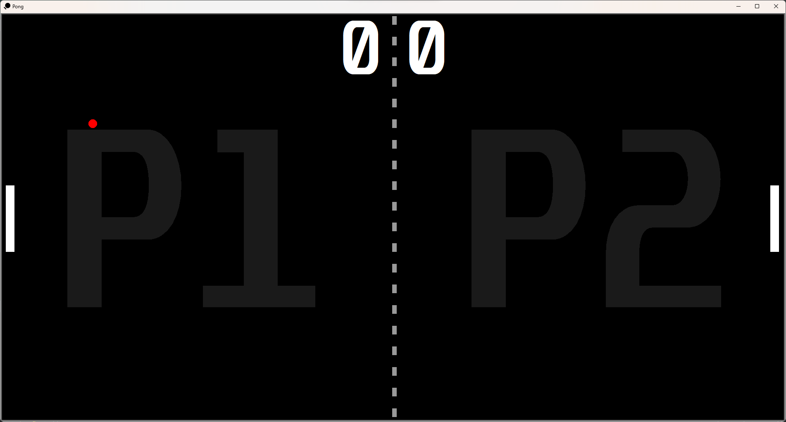

# Pong 🏓

## Overview 📄

This game is based on a classic two-player arcade game, Pong, from (1972). It is built using Python's Turtle graphics module. The objective is to prevent the ball from colliding with the walls behind your paddle. Players score points when the opponent fails to prevent the ball from hitting the wall.

## Gameplay 🎮

- Use the **w** and **s** keys for the left player to move the paddle up and down, respectively.
- Use the **up** and **down** arrow keys for the right player to move the paddle up and down, respectively.
- Press the **Escape** key to exit the game.

## Starting Window 🔲

On the starting window, enter the number of rounds to play. If no number is given, the default is set to 1 round. <br>


## Scoring 🎯

- When the ball collides with the wall behind the opponent's paddle, the opponent gains 1 point.
- The game ends when one of the players reaches the specified number of rounds.

## Features 💫

- The speed of the ball increases as it hits the paddles.
- The speed resets if the ball touches the wall.

## Running the Game ▶️

To play the game, run the main file:

```bash
python main.py
```

## Dependencies ⚙️

The game is built using Python's Turtle graphics module. No additional dependencies are required.

## Preview 📸

- Game Screen <br>


- Game Over <br>
